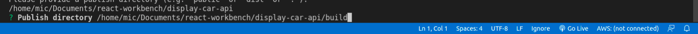

# Car Search

### This is a React Project that allows the user to search for different kinds of cars      
### Live Site: https://find-car.netlify.app/
 
It works in tandum with a project that I made previously: 
   

https://github.com/micloudon/carApi  
It pulls data from this api in the form of Json objects

**Useful React commands:**  

Start your project:
>npx create-react-app yourprojectname  

Run dev server:
>yarn start

Install dependencies
>yarn add  
    

**Deployment:**  
This app is deployed on Netlify  
**deployment instructions:** 

Build Project
>yarn build

install netlify globally:  
>npm install netlify-cli -g  

authorize cli and start deployment:  
>netlify deploy  

cli prompt 1: Create & configure a new site  
cli prompt 2: Choose site name (or leave blank)  
cli prompt 3: Set build path to you build directory (follow the image below)  
  

If everthing looks good finish up with:  
>netlify deploy --prod  

cli prompt 1: Enter you build path again, same as before  
Your site is now deployed on netlify

